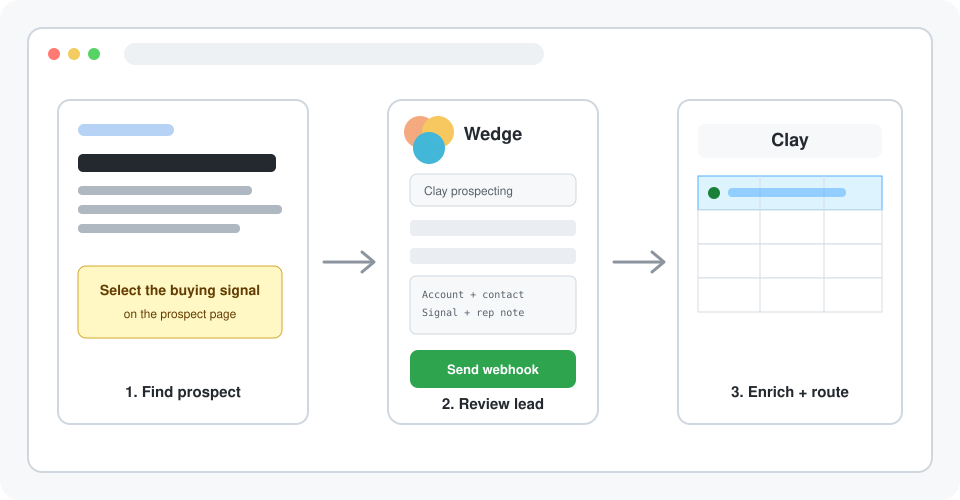

<h3 align="center">Keep prospecting without breaking focus or building a copy-paste backlog</h3>

Wedge lets you capture a promising account or contact while it is still on screen when manual entry would break your prospecting flow, by sending the page context and your notes into a saved Clay workflow that can enrich the record and route it to your CRM or outbound campaign.

&nbsp;&nbsp;

✓&nbsp;100%&nbsp;free&nbsp;and&nbsp;open&nbsp;source &nbsp; ✓&nbsp;No&nbsp;backend&nbsp;or&nbsp;Wedge&nbsp;account &nbsp; ✓&nbsp;Built&nbsp;for&nbsp;Clay-powered&nbsp;prospecting

<small>⭐ Used by top sales reps</small>

 

## Stay in the prospecting flow from first page to finished list

Promising prospects enter Clay while the context is fresh, where your workflow can enrich them and route them into the right CRM list or outbound campaign. You finish the session with follow-up already moving instead of a bookmark folder to process.

## Choose between copy-paste, bookmark backlogs, custom extensions — or capturing the prospect from the page you're on

| | **Wedge** | Manual copy-paste | Generic form tools | Custom extension |
|---|:---:|:---:|:---:|:---:|
| **Free software** | ✅ | ✅ | ❌ | ✅ |
| **No code needed** | ✅ | ✅ | ✅ | ❌ |
| **No third-party form service** | ✅ | ✅ | ❌ | ✅ |
| **Captures from the source page** | ✅ | ❌ | ❌ | ✅ |
| **Reusable prospecting forms** | ✅ | ❌ | ✅ | ✅ |
| **Local configuration and history** | ✅ | ❌ | ❌ | ✅ |
| **Autofills prospect context** | ✅ | ❌ | ❌ | ✅ |
| **Review before enrichment** | ✅ | ❌ | ❌ | ✅ |
| **Routes to multiple Clay workflows** | ✅ | ❌ | ❌ | ✅ |

Capture the lead while you're browsing. Wedge fills the repeated fields, you add any important notes, and Clay receives the context it needs for enrichment and routing.

## Capture a company or contact while you’re browsing. Get it enriched and routed through Clay in seconds.

### 📈 Capture prospects as you browse
Capture the company or contact while it is still on screen. Wedge sends the context to Clay, where your workflow can enrich it and route it to your CRM or outbound campaign.

### ⚡ Let Wedge fill the details you'd otherwise copy
Saved forms and fixed fields keep recurring values in place. You add what changed, then send the prospect into the right Clay workflow.

### 💬 Update the pipeline without switching tabs
Capture from the source page. Clay can enrich the record and move it into the CRM list or outbound campaign you configured.

## Capture your first prospect in five minutes

<table>
<tr>
<td align="center" valign="top" width="33%"><h3>1️⃣</h3><b>Install Wedge</b> Download the latest release, unzip it, and load the folder in Chrome's Developer mode.</td>
<td align="center" valign="top" width="33%"><h3>2️⃣</h3><b>Connect a sales workflow</b> Paste its Clay webhook URL, then choose the prospect details that workflow needs for enrichment and routing.</td>
<td align="center" valign="top" width="33%"><h3>3️⃣</h3><b>Capture a prospect</b> Open a company, contact, or signal page, check the context, and send it into the Clay workflow you chose.</td>
</tr>
</table>

## Choose how to get started

<table>
<tr>
<td align="center" valign="top" width="50%"><h3>Self-serve</h3>For sales reps and GTM teams with Clay workflows <h2>Free</h2>
&nbsp;&nbsp;&nbsp;✓&nbsp; Multiple Clay prospecting workflows &nbsp;&nbsp;&nbsp;✓&nbsp; Automatic page context and selected evidence &nbsp;&nbsp;&nbsp;✓&nbsp; Custom, fixed, and rep profile fields &nbsp;&nbsp;&nbsp;✓&nbsp; Review every prospect before sending &nbsp;&nbsp;&nbsp;✓&nbsp; Local activity history and errors &nbsp;&nbsp;&nbsp;✓&nbsp; Import and export reusable team setups
</td>
<td align="center" valign="top" width="50%"><h3>Done-with-you</h3>Hands-on setup and ongoing support for your sales team <h2>Let's talk</h2>
&nbsp;&nbsp;&nbsp;✓&nbsp; Everything in self-serve &nbsp;&nbsp;&nbsp;✓&nbsp; Full setup and installation &nbsp;&nbsp;&nbsp;✓&nbsp; Clay webhook and authentication configuration &nbsp;&nbsp;&nbsp;✓&nbsp; Capture forms configured for your team &nbsp;&nbsp;&nbsp;✓&nbsp; Team rollout, training, and best practices &nbsp;&nbsp;&nbsp;✓&nbsp; Ongoing maintenance and upgrades &nbsp;&nbsp;&nbsp;✓&nbsp; Dedicated Slack channel support
</td>
</tr>
<tr>
<td align="center"></td>
<td align="center"></td>
</tr>
</table>

## Get your questions answered

### Do I need to know how to code?
No. Download the latest release and load it as an unpacked Chrome extension. Building from source is optional.

### Do I need to run a backend?
No. Wedge posts directly from the extension to the Clay webhook you configure.

### What leaves my browser?
Only the payload you preview and the optional Clay authentication header are sent when you click Send. Your webhook configs, tokens, schemas, and activity history stay in Chrome's local extension storage.

### Can I choose exactly what gets sent?
Yes. Build each sales workflow's capture form from page fields, selected text, custom inputs, dropdowns, checkboxes, fixed values, and rep profile fields, then review the prospect before sending.

### Can I route prospects to more than one sales workflow?
Yes. Save multiple Clay webhooks with independent capture forms, choose a default, and switch between account, contact, signal, or other destinations from the popup.

### Can I share a setup with my team?
Yes. Export one webhook or all of them as JSON, with tokens excluded unless you explicitly include them, then import the config in another browser.

## Capture your first prospect in five minutes

A prospect can enter Clay for enrichment and routing in about five minutes for free. Wedge captures the repeated context. You add any important notes and click Send.

&nbsp;&nbsp;

✓&nbsp;100%&nbsp;free&nbsp;and&nbsp;open&nbsp;source &nbsp; ✓&nbsp;No&nbsp;backend&nbsp;or&nbsp;Wedge&nbsp;account &nbsp; ✓&nbsp;Built&nbsp;for&nbsp;Clay-powered&nbsp;prospecting

<small>⭐ Used by top sales reps</small>

